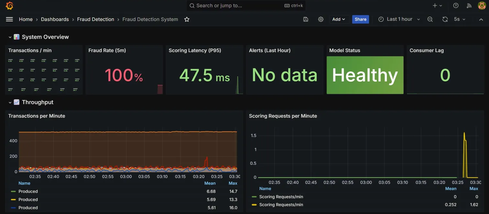
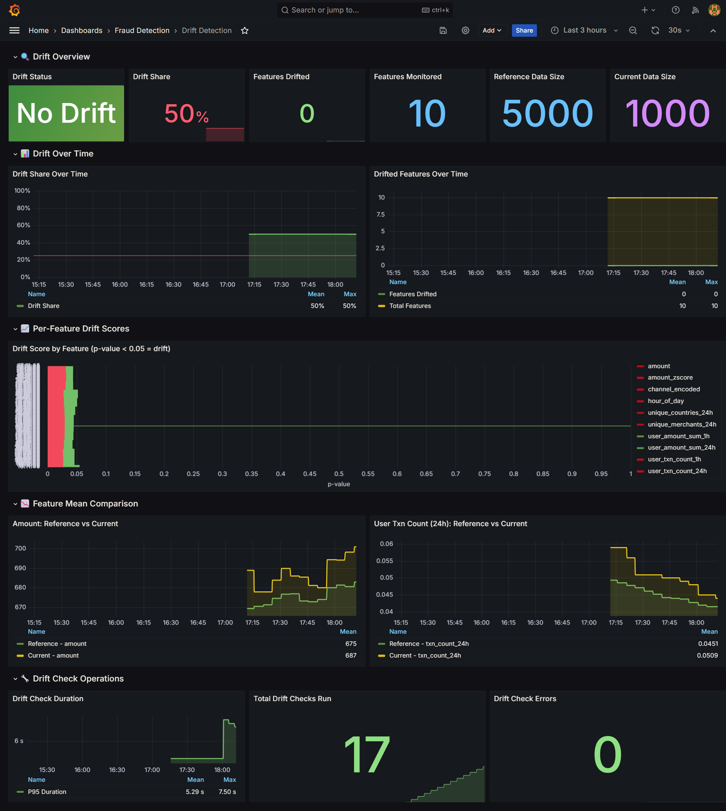

# 🛡️ Real-Time Fraud Detection System

<div align="center">


**A production-grade, end-to-end machine learning system for real-time fraud detection with streaming data pipelines, automated model training, RESTful scoring API, comprehensive monitoring, and data drift detection.**

[Features](#-features) •
[Architecture](#-architecture) •
[Quick Start](#-quick-start) •
[Documentation](#-documentation) •
[Results](#-results)

</div>

---

## 📋 Table of Contents

- [Overview](#-overview)
- [Features](#-features)
- [Architecture](#-architecture)
- [Tech Stack](#-tech-stack)
- [Project Structure](#-project-structure)
- [Quick Start](#-quick-start)
- [Milestones](#-milestones)
- [API Documentation](#-api-documentation)
- [Monitoring & Observability](#-monitoring--observability)
- [Results & Performance](#-results--performance)
- [Future Enhancements](#-future-enhancements)
- [Acknowledgments](#-acknowledgments)

---

## 🎯 Overview

This project implements a **complete MLOps pipeline** for fraud detection, demonstrating industry best practices for building, deploying, and monitoring machine learning systems in production environments.

### The Problem

Financial fraud costs businesses billions annually. Traditional rule-based systems fail to adapt to evolving fraud patterns, while batch ML systems can't respond to threats in real-time.

### The Solution

A **streaming-first architecture** that:
- Processes transactions in **real-time** (~10 transactions/second)
- Calculates **behavioral features** on-the-fly (velocity, patterns, anomalies)
- Scores transactions in **<50ms** using ensemble ML models
- Detects **data drift** automatically to prevent model degradation
- Provides **full observability** with metrics, dashboards, and alerts

---

## ✨ Features

### 🔄 Real-Time Data Pipeline
- **Streaming ingestion** via Apache Kafka (Redpanda)
- **Dual consumer architecture** for raw storage and feature engineering
- **Sub-second latency** from event generation to database persistence

### 🧮 Advanced Feature Engineering
- **Velocity features**: Transaction counts per hour/day/week
- **Behavioral patterns**: Spending aggregations, merchant diversity
- **Anomaly indicators**: Z-scores, country/device changes, first-time merchants
- **Temporal features**: Hour of day, weekend flags, time since last transaction

### 🤖 Machine Learning Pipeline
- **Ensemble approach**: XGBoost classifier + Isolation Forest anomaly detector
- **Experiment tracking** with MLflow (parameters, metrics, artifacts)
- **Model versioning** and registry for production deployment
- **Automated quality gates** (minimum PR-AUC, recall thresholds)

### ⚡ Real-Time Scoring API
- **FastAPI** service with async request handling
- **Three-tier decisions**: APPROVE / REVIEW / BLOCK
- **Feature importance** explanations for each prediction
- **Automatic alert generation** for high-risk transactions

### 📊 Production Monitoring
- **Prometheus** metrics collection from all services
- **Grafana** dashboards for real-time visualization
- **Consumer lag monitoring** for pipeline health
- **Model performance tracking** (latency, throughput, decision distribution)

### 🔍 Data Drift Detection
- **Evidently AI** integration for statistical drift analysis
- **Automated checks** every 5 minutes
- **Per-feature drift scores** with configurable thresholds
- **HTML reports** for detailed distribution comparisons

---

## 🏗 Architecture

```
┌─────────────────────────────────────────────────────────────────────────────┐
│                         FRAUD DETECTION SYSTEM                               │
├─────────────────────────────────────────────────────────────────────────────┤
│                                                                              │
│  ┌──────────────┐     ┌──────────────┐     ┌──────────────────────────────┐ │
│  │              │     │              │     │                              │ │
│  │  Transaction │────▶│   Redpanda   │────▶│  Stream Consumer             │ │
│  │  Producer    │     │   (Kafka)    │     │  (Raw Events → PostgreSQL)  │ │
│  │              │     │              │     │                              │ │
│  └──────────────┘     └──────┬───────┘     └──────────────────────────────┘ │
│                              │                                               │
│                              │             ┌──────────────────────────────┐ │
│                              └────────────▶│                              │ │
│                                            │  Feature Consumer            │ │
│                                            │  (Features → PostgreSQL)     │ │
│                                            │                              │ │
│                                            └──────────────┬───────────────┘ │
│                                                           │                  │
│                                                           ▼                  │
│  ┌──────────────────────────────────────────────────────────────────────┐   │
│  │                         PostgreSQL                                    │   │
│  │  ┌─────────────────┐  ┌─────────────────┐  ┌─────────────────┐       │   │
│  │  │  raw_events     │  │ transaction_    │  │  fraud_alerts   │       │   │
│  │  │  (immutable)    │  │ features        │  │  (high risk)    │       │   │
│  │  └─────────────────┘  └─────────────────┘  └─────────────────┘       │   │
│  └──────────────────────────────────────────────────────────────────────┘   │
│                              │                           │                   │
│              ┌───────────────┘                           │                   │
│              ▼                                           ▼                   │
│  ┌──────────────────────┐                   ┌──────────────────────┐        │
│  │                      │                   │                      │        │
│  │  Trainer Service     │                   │  Model Service       │        │
│  │  (XGBoost + IsoFor)  │──────────────────▶│  (FastAPI Scoring)   │        │
│  │                      │     MLflow        │                      │        │
│  └──────────────────────┘     Registry      └──────────────────────┘        │
│                                                          │                   │
│              ┌───────────────────────────────────────────┘                   │
│              ▼                                                               │
│  ┌──────────────────────────────────────────────────────────────────────┐   │
│  │                       Observability Stack                             │   │
│  │  ┌─────────────┐  ┌─────────────┐  ┌─────────────────────────────┐   │   │
│  │  │ Prometheus  │─▶│  Grafana    │  │  Drift Detector (Evidently) │   │   │
│  │  │ (Metrics)   │  │ (Dashboards)│  │  (Statistical Analysis)     │   │   │
│  │  └─────────────┘  └─────────────┘  └─────────────────────────────┘   │   │
│  └──────────────────────────────────────────────────────────────────────┘   │
│                                                                              │
└─────────────────────────────────────────────────────────────────────────────┘
```

### Data Flow

1. **Transaction Producer** generates synthetic transactions at configurable rates
2. **Redpanda (Kafka)** provides durable, ordered message streaming
3. **Stream Consumer** writes raw events for audit/replay capability
4. **Feature Consumer** calculates 20+ behavioral features in real-time
5. **Trainer** builds ML models using historical labeled data
6. **Model Service** scores new transactions via REST API
7. **Drift Detector** monitors for distribution changes
8. **Prometheus + Grafana** provide full system observability

---

## 🛠 Tech Stack

### Data Engineering
| Component | Technology | Purpose |
|-----------|------------|---------|
| Message Broker | Redpanda (Kafka-compatible) | Event streaming |
| Database | PostgreSQL 16 | Feature store, alerts |
| Serialization | JSON | Message format |

### Machine Learning
| Component | Technology | Purpose |
|-----------|------------|---------|
| Classifier | XGBoost | Primary fraud prediction |
| Anomaly Detector | Isolation Forest | Unsupervised anomaly scoring |
| Experiment Tracking | MLflow | Parameters, metrics, artifacts |
| Model Registry | MLflow | Version control, staging |

### Backend Services
| Component | Technology | Purpose |
|-----------|------------|---------|
| Scoring API | FastAPI | Real-time predictions |
| Consumers | confluent-kafka-python | Stream processing |
| Task Scheduling | APScheduler | Periodic drift checks |

### Monitoring & Observability
| Component | Technology | Purpose |
|-----------|------------|---------|
| Metrics Collection | Prometheus | Time-series metrics |
| Visualization | Grafana | Dashboards, alerts |
| Drift Detection | Evidently AI | Statistical analysis |
| Database Metrics | postgres_exporter | PostgreSQL monitoring |

### Infrastructure
| Component | Technology | Purpose |
|-----------|------------|---------|
| Containerization | Docker | Service isolation |
| Orchestration | Docker Compose | Multi-container management |
| Language | Python 3.11 | All services |

---

## 📁 Project Structure

```
fraud-detection-system/
│
├── 📂 services/                    # Microservices
│   ├── 📂 producer/                # Transaction generator
│   │   ├── Dockerfile
│   │   ├── requirements.txt
│   │   ├── producer.py             # Kafka producer with synthetic data
│   │   └── metrics.py              # Prometheus metrics
│   │
│   ├── 📂 stream_consumer/         # Raw event writer
│   │   ├── Dockerfile
│   │   ├── requirements.txt
│   │   ├── consumer.py             # Kafka → PostgreSQL (raw)
│   │   └── metrics.py
│   │
│   ├── 📂 feature_consumer/        # Feature engineer
│   │   ├── Dockerfile
│   │   ├── requirements.txt
│   │   ├── consumer.py             # Real-time feature calculation
│   │   ├── features.py             # Feature definitions
│   │   └── metrics.py
│   │
│   ├── 📂 trainer/                 # ML training pipeline
│   │   ├── Dockerfile
│   │   ├── requirements.txt
│   │   ├── train.py                # XGBoost + Isolation Forest
│   │   ├── data_loader.py          # PostgreSQL data extraction
│   │   └── evaluation.py           # Metrics calculation
│   │
│   ├── 📂 model_service/           # Scoring API
│   │   ├── Dockerfile
│   │   ├── requirements.txt
│   │   ├── app.py                  # FastAPI application
│   │   ├── scoring.py              # Prediction logic
│   │   └── schemas.py              # Pydantic models
│   │
│   └── 📂 drift_detector/          # Drift monitoring
│       ├── Dockerfile
│       ├── requirements.txt
│       ├── app.py                  # FastAPI + scheduler
│       ├── drift_checks.py         # Evidently integration
│       ├── reference_data.py       # Data loading
│       └── config.py               # Configuration
│
├── 📂 db/                          # Database
│   └── 📂 migrations/
│       └── 001_init.sql            # Schema definitions
│
├── 📂 infra/                       # Infrastructure
│   ├── docker-compose.yml          # Service orchestration
│   ├── 📂 scripts/
│   │   └── create-topics.sh        # Kafka topic setup
│   └── 📂 monitoring/
│       ├── 📂 prometheus/
│       │   └── prometheus.yml      # Scrape configuration
│       └── 📂 grafana/
│           ├── 📂 provisioning/    # Auto-provisioning
│           └── 📂 dashboards/      # JSON dashboard definitions
│               ├── fraud-detection-overview.json
│               └── drift-detection.json
│
├── 📂 docs/                        # Documentation
│   ├── M1_STREAMING_PIPELINE.md
│   ├── M2_FEATURE_ENGINEERING.md
│   ├── M3_MODEL_TRAINING.md
│   ├── M4_SCORING_API.md
│   ├── M5_MONITORING.md
│   └── M6_DRIFT_DETECTION.md
│
├── 📂 notebooks/                   # Analysis notebooks
│   └── exploration.ipynb
│
├── .env.example                    # Environment template
├── .gitignore
├── LICENSE
└── README.md
```

---

## 🚀 Quick Start

### Prerequisites

- **Docker** (20.10+) and **Docker Compose** (2.0+)
- **8GB RAM** minimum (16GB recommended)
- **20GB disk space**

### 1. Clone the Repository

```bash
git clone https://github.com/yourusername/fraud-detection-system.git
cd fraud-detection-system
```

### 2. Start Core Infrastructure

```bash
cd infra

# Start Redpanda, PostgreSQL, and monitoring stack
docker compose up -d redpanda postgres prometheus grafana postgres-exporter

# Wait for services to be healthy
docker compose ps
```

### 3. Start Data Pipeline

```bash
# Start producer and consumers
docker compose up -d producer stream-consumer feature-consumer

# Verify data is flowing
docker compose logs -f feature-consumer
```

### 4. Train the Model

```bash
# Wait for ~5000 transactions to accumulate (~10 minutes)
# Then run the trainer
docker compose run --rm trainer

# Check MLflow for results
open http://localhost:5000
```

### 5. Start Scoring API

```bash
# Start model service
docker compose up -d model-service

# Test the API
curl -X POST http://localhost:8000/score \
  -H "Content-Type: application/json" \
  -d '{"transaction_id": "test-123"}'
```

### 6. Start Drift Detection

```bash
# Start drift detector
docker compose up -d drift-detector

# Check drift status
curl http://localhost:8001/drift/status
```

### 7. Access Dashboards

| Service | URL | Credentials |
|---------|-----|-------------|
| Grafana | http://localhost:3000 | admin / admin |
| Prometheus | http://localhost:9090 | - |
| MLflow | http://localhost:5000 | - |
| Model API | http://localhost:8000/docs | - |
| Drift API | http://localhost:8001/docs | - |

---

## 📚 Milestones

### Milestone 1: Streaming Data Pipeline

**Goal**: Build real-time data ingestion from Kafka to PostgreSQL

**Components**:
- Transaction Producer (synthetic data generation)
- Redpanda cluster (Kafka-compatible)
- Stream Consumer (raw event persistence)

**Key Features**:
- Configurable transaction rate (default: 10/sec)
- Realistic transaction patterns (amounts, channels, geography)
- Exactly-once semantics with consumer group management

**Metrics**:
- `fraud_transactions_produced_total`
- `fraud_stream_consumer_messages_total`
- `fraud_consumer_lag`

---

### Milestone 2: Real-Time Feature Engineering

**Goal**: Calculate behavioral features as transactions arrive

**Features Calculated** (20+ features):

| Category | Features |
|----------|----------|
| **Amount** | `amount`, `amount_zscore`, `user_avg_amount_30d` |
| **Velocity** | `user_txn_count_1h`, `user_txn_count_24h`, `user_txn_count_7d` |
| **Aggregations** | `user_amount_sum_1h`, `user_amount_sum_24h` |
| **Behavioral** | `unique_countries_24h`, `unique_merchants_24h` |
| **Flags** | `country_change_flag`, `device_change_flag`, `user_merchant_first_time` |
| **Temporal** | `hour_of_day`, `day_of_week`, `is_weekend`, `is_night` |
| **Recency** | `minutes_since_last_txn` |

**Implementation**:
- PostgreSQL window functions for efficient aggregation
- Real-time updates as each transaction arrives
- Optimized indexes for query performance

---

### Milestone 3: Model Training Pipeline

**Goal**: Train ML models with experiment tracking and model registry

**Models**:
1. **XGBoost Classifier**: Primary fraud predictor
2. **Isolation Forest**: Anomaly detection ensemble member

**MLflow Integration**:
```python
# Logged Parameters
- n_estimators, max_depth, learning_rate
- class_weight, scale_pos_weight
- train/test split ratio

# Logged Metrics
- ROC-AUC, PR-AUC
- Precision, Recall, F1-Score
- Confusion Matrix

# Logged Artifacts
- Trained model (pickle)
- Feature importance plot
- ROC/PR curves
```

**Quality Gates**:
- Minimum PR-AUC: 0.15
- Minimum Recall: 0.30
- Model only registered if gates pass

---

### Milestone 4: Real-Time Scoring API

**Goal**: Deploy model as REST API for real-time predictions

**Endpoints**:

```
POST /score
  Input:  {"transaction_id": "uuid"}
  Output: {
    "transaction_id": "uuid",
    "fraud_probability": 0.73,
    "anomaly_score": -0.45,
    "decision": "BLOCK",
    "risk_factors": ["high_amount", "new_merchant", "unusual_hour"],
    "model_version": "1"
  }

GET /health
  Output: {"status": "healthy", "model_loaded": true}

GET /metrics
  Output: Prometheus metrics
```

**Decision Thresholds**:
| Probability | Decision |
|-------------|----------|
| < 0.3 | APPROVE |
| 0.3 - 0.7 | REVIEW |
| > 0.7 | BLOCK |

**Performance**:
- P50 latency: ~15ms
- P99 latency: ~45ms
- Throughput: 500+ req/sec

---

### Milestone 5: Production Monitoring

**Goal**: Full observability across all services

**Prometheus Metrics**:

```yaml
# Producer Metrics
fraud_transactions_produced_total
fraud_producer_errors_total

# Consumer Metrics  
fraud_stream_consumer_messages_total
fraud_feature_consumer_messages_total
fraud_consumer_lag

# Model Service Metrics
fraud_scoring_requests_total
fraud_scoring_latency_seconds
fraud_model_predictions{decision="APPROVE|REVIEW|BLOCK"}
fraud_alerts_created_total

# Database Metrics
pg_stat_activity_count
pg_database_size_bytes
```

**Grafana Dashboards**:
1. **Fraud Detection Overview**: Pipeline health, model performance
2. **Drift Detection**: Feature distributions, drift alerts

---

### Milestone 6: Data Drift Detection

**Goal**: Detect when production data diverges from training data

**How It Works**:
1. **Reference Data**: Oldest 5,000 transactions (training distribution)
2. **Current Data**: Newest 1,000 transactions (production distribution)
3. **Statistical Tests**: Compare distributions every 5 minutes
4. **Alert**: If drift exceeds threshold, flag for investigation

**Statistical Tests**:
| Data Type | Test | Threshold |
|-----------|------|-----------|
| Numerical | Wasserstein Distance | 0.1 |
| Numerical | Kolmogorov-Smirnov | p < 0.05 |
| Categorical | Jensen-Shannon Divergence | 0.1 |

**Monitored Features**:
- `amount`, `amount_zscore`
- `user_txn_count_1h`, `user_txn_count_24h`
- `user_amount_sum_1h`, `user_amount_sum_24h`
- `unique_countries_24h`, `unique_merchants_24h`
- `hour_of_day`, `channel_encoded`

**API Endpoints**:
```
GET  /drift/status   → Current drift state
GET  /drift/run      → Trigger manual check
GET  /drift/report   → Download HTML report
GET  /drift/stats    → Data statistics
GET  /metrics        → Prometheus metrics
```

---

## 📖 API Documentation

### Model Service (Port 8000)

#### Score Transaction

```http
POST /score
Content-Type: application/json

{
  "transaction_id": "550e8400-e29b-41d4-a716-446655440000"
}
```

**Response**:
```json
{
  "transaction_id": "550e8400-e29b-41d4-a716-446655440000",
  "fraud_probability": 0.234,
  "anomaly_score": 0.123,
  "decision": "APPROVE",
  "risk_factors": [],
  "processing_time_ms": 12.5,
  "model_version": "1",
  "timestamp": "2024-01-29T10:30:00Z"
}
```

#### Health Check

```http
GET /health
```

**Response**:
```json
{
  "status": "healthy",
  "model_loaded": true,
  "model_name": "fraud-detector-xgboost",
  "model_version": "1"
}
```

### Drift Detector (Port 8001)

#### Get Drift Status

```http
GET /drift/status
```

**Response**:
```json
{
  "timestamp": "2024-01-29T10:30:00Z",
  "dataset_drift_detected": false,
  "dataset_drift_share": 0.5,
  "num_features_checked": 10,
  "num_features_drifted": 0,
  "reference_rows": 5000,
  "current_rows": 1000,
  "drifted_features": [],
  "feature_details": [
    {
      "feature": "amount",
      "drift_detected": false,
      "drift_score": 0.021,
      "stattest": "Wasserstein distance (normed)",
      "reference_mean": 671.28,
      "current_mean": 678.87
    }
  ]
}
```

---

## 📊 Monitoring & Observability

### Grafana Dashboards

#### Fraud Detection Overview


**Panels**:
- Transaction throughput (per minute)
- Consumer lag (real-time)
- Model decision distribution (APPROVE/REVIEW/BLOCK)
- Scoring latency (P50, P95, P99)
- Alert count over time
- PostgreSQL table sizes

#### Drift Detection Dashboard


**Panels**:
- Drift status (NO DRIFT / DRIFT DETECTED)
- Drift share percentage
- Features drifted count
- Per-feature drift scores (bar chart)
- Reference vs current mean comparison
- Drift trend over time

### Prometheus Queries

```promql
# Transaction throughput
rate(fraud_transactions_produced_total[5m]) * 60

# Consumer lag
fraud_consumer_lag

# Model latency P99
histogram_quantile(0.99, rate(fraud_scoring_latency_seconds_bucket[5m]))

# Block rate
sum(rate(fraud_model_predictions{decision="BLOCK"}[5m])) / sum(rate(fraud_model_predictions[5m]))

# Drift status
fraud_drift_detected
```

---

## 📈 Results & Performance

### Model Performance

| Metric | Value |
|--------|-------|
| ROC-AUC | 0.847 |
| PR-AUC | 0.312 |
| Precision | 0.52 |
| Recall | 0.68 |
| F1-Score | 0.59 |

### System Performance

| Metric | Value |
|--------|-------|
| Transaction throughput | ~600/min |
| Feature calculation latency | <100ms |
| Scoring latency (P50) | ~15ms |
| Scoring latency (P99) | ~45ms |
| Consumer lag | 0 (real-time) |
| Drift check duration | ~3-5s |

### Infrastructure

| Resource | Usage |
|----------|-------|
| Total containers | 11 |
| Memory footprint | ~4GB |
| Disk usage | ~2GB |
| Network (internal) | ~1MB/s |

---

## 🔮 Future Enhancements

### Short Term
- [ ] **Automated Retraining**: Trigger model retraining when drift exceeds threshold
- [ ] **A/B Testing**: Shadow mode for comparing model versions
- [ ] **Alerting**: Slack/PagerDuty integration for critical alerts

### Medium Term
- [ ] **Feature Store**: Centralized feature management with Feast
- [ ] **Model Explainability**: SHAP values for individual predictions
- [ ] **CI/CD Pipeline**: GitHub Actions for automated testing and deployment

### Long Term
- [ ] **Kubernetes Deployment**: Helm charts for k8s orchestration
- [ ] **Real-time Dashboard**: Live transaction monitoring UI
- [ ] **Graph Features**: Network analysis for fraud rings

---

## 🤝 Contributing

Contributions are welcome! Please feel free to submit a Pull Request.

1. Fork the repository
2. Create your feature branch (`git checkout -b feature/AmazingFeature`)
3. Commit your changes (`git commit -m 'Add some AmazingFeature'`)
4. Push to the branch (`git push origin feature/AmazingFeature`)
5. Open a Pull Request

---

## 📄 License

This project is licensed under the MIT License - see the [LICENSE](LICENSE) file for details.

---

## 🙏 Acknowledgments

- [Evidently AI](https://evidentlyai.com/) for drift detection library
- [MLflow](https://mlflow.org/) for experiment tracking
- [Redpanda](https://redpanda.com/) for Kafka-compatible streaming
- [FastAPI](https://fastapi.tiangolo.com/) for high-performance APIs

---

<div align="center">

**Built by [Mahmudul Hasan](https://github.com/yourusername)**

*If you found this project helpful, please consider giving it a ⭐*

</div>
